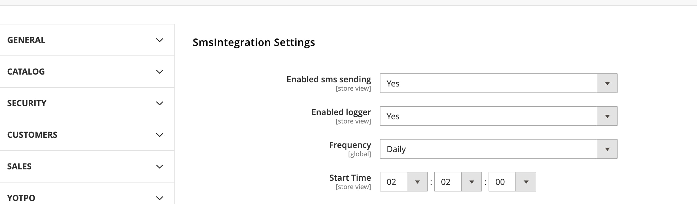
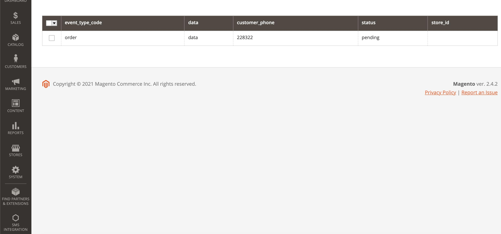
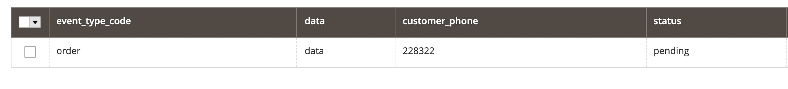
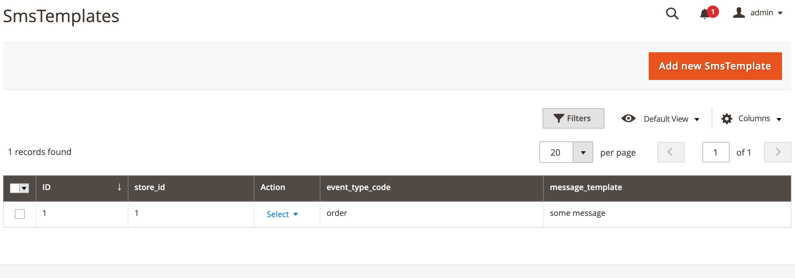
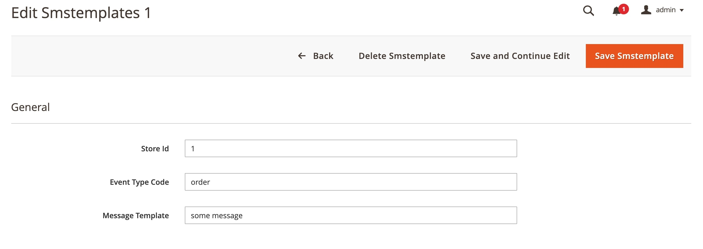
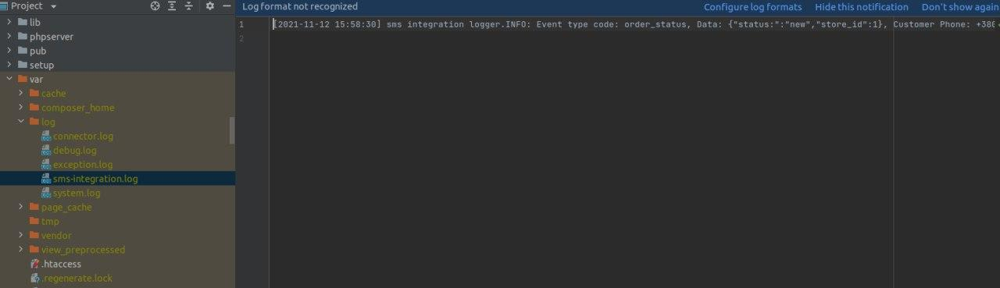

The SmsIntegration module notifies the customizer via SMS about some event (changing the order status, registering the custom, resetting the password, creating an invoice)

⚠️ Magento versions compatibility :
The module is compatible with Magento version 2.4 and higher, and php version 7.4 and higher

Main Features:

After installing the module, settings appear in (stores > configurations > smsintegrations) where you can enable SMS sending, enable logging, set up a schedule for sending SMS via crone

There you can also enter the login and password from the connected SMS provider

And also enter the maximum number of characters in the message (if the number of characters in the message is more than set in this setting, then the message will be truncated).
If the number of unsuccessful attempts to send a message is more than set in the max count attempts setting, then such messages will not be sent

After installing the module, an item appears in the Sms Integration menu
where it is possible to go to the grid of messages and the grid of SMS templates
In the message grid, you can see what event the message was created for and the message sending status.

In the template grid, you can see all the message template for which event and in which store it is set. You can create a new template by clicking on the add new sms template button, after which a form for creating a template will open, existing slopes can be edited by clicking on the action cell and then click on edit after which a form for editing the template will open.

If logging is enabled in the settings, then all messages will be logged to a file at.
Errors when sending messages will be logged to the same log file.
